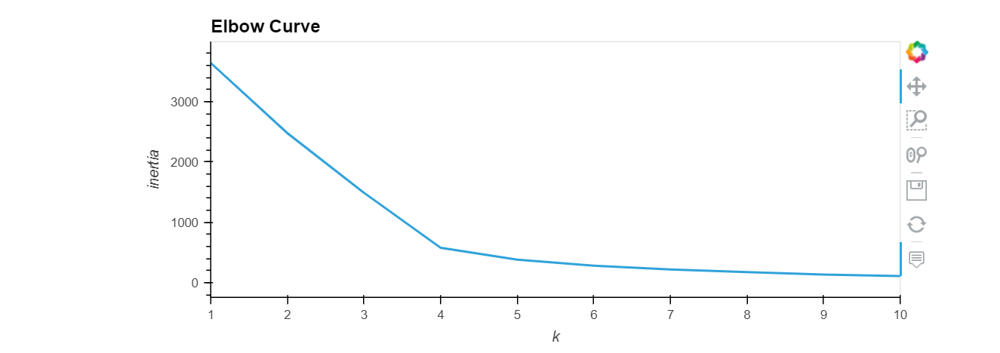
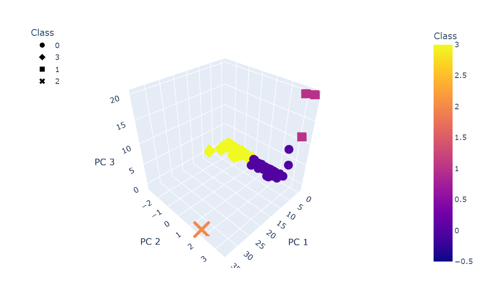
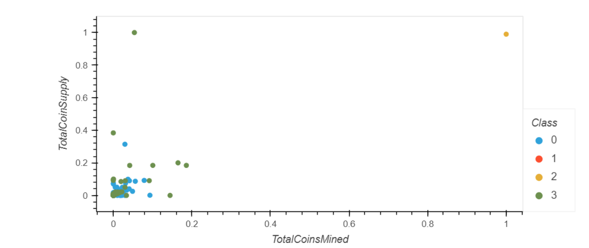

# Cryptocurrencies

## Project Overview
Using unsupervised learning, the purpose of this project was to analyze a data set of cryptocurrencies and create a report that included the traded currencies classified by their features. By reprocessing the data base, we were able to visualize classification results with 2D and 3D scatter plots.

## Results
### Elbow curve

For the above image of the Elbow Curve, it can be concluded that the optimal number of clusters is 4. 

### 3 Demensional Plot

By using PCA, 3 components were created to analyze the data. As seen above, there are 3 major groups and one outlier.

### 2 Dimensional Plot

Similarly, the above graph of the clustered crytocurrencies by total supply and mined coins, we can see there are two outliers.

## Summary
Using machine learning to discover patterns or similarities in data, and as shown here there are 4 major groups of cryptocurrencies. While there is much more analysis to be done on this dataset, this is a good starting point for determining profitability of cryptocurrencies as well as the supply/mined coins.
